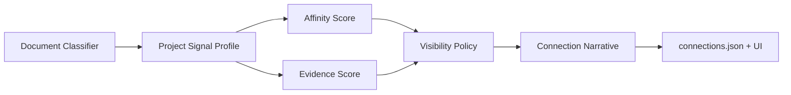

# Connection Engine V2 Implementation Plan

> **Status:** Implemented in `main` as of 2026-03-31. This document is retained as the design and rollout record, not the source of truth for runtime behavior.
> 
> **Source of truth:** `collective-memory/scripts/research_sync.js`, the modules in `collective-memory/scripts/lib/`, and the UI helpers in `src/lib/`.
> 
> **Live demo:** https://nestorfernando3.github.io/collective-memory-ui/

> **For agentic workers:** REQUIRED SUB-SKILL: Use superpowers:subagent-driven-development (recommended) or superpowers:executing-plans to implement this plan task-by-task. Steps use checkbox (`- [ ]`) syntax for tracking.

**Goal:** Rebuild the connection engine so it separates affinity from evidence, filters documentary noise before scoring, applies a real coverage-floor policy, and emits strong vs exploratory links with specific narratives and UI semantics.

**Architecture:** Keep `collective-memory/scripts/research_sync.js` as the CLI entrypoint and orchestration layer, but move decision logic into focused modules: document classification, inferred metadata, affinity scoring, evidence validation, visibility policy, and narrative generation. Preserve the `connections.json` array contract while adding a stable `decision` block and richer `evidence` fragments so the UI can render stronger semantics without breaking the snapshot workflow.

**Tech Stack:** Node.js, `node:test`, JSON snapshot files, React helpers in `src/lib`, existing `research_sync.js` CLI, and the current UI graph model / insight helpers.

---

## File Map

**Connection engine orchestration**
- Modify: `collective-memory/scripts/research_sync.js`
  - Keep CLI parsing, project loading, reporting, and snapshot writing.
  - Replace inline scoring / filtering logic with calls into focused modules.

**New scoring modules**
- Create: `collective-memory/scripts/lib/document_classifier.js`
  - Classify files into A/B/C/D/X document tiers before they can contribute evidence.
- Create: `collective-memory/scripts/lib/inferred_metadata.js`
  - Infer lightweight domains, themes, institutions, and frameworks from level A/B documents.
- Create: `collective-memory/scripts/lib/project_signal_profile.js`
  - Build the normalized per-project signal object used downstream.
- Create: `collective-memory/scripts/lib/candidate_affinity.js`
  - Compute `affinity_score` from explicit + inferred metadata and structured project text.
- Create: `collective-memory/scripts/lib/evidence_validator.js`
  - Compute `evidence_score`, breakdown, and fragments from only allowed documents.
- Create: `collective-memory/scripts/lib/visibility_policy.js`
  - Map `(affinity, evidence)` to `strong`, `exploratory`, `review`, `discarded`, then apply coverage-floor promotion.
- Create: `collective-memory/scripts/lib/connection_narrative.js`
  - Build descriptions based on `tier`, `selectionReason`, and evidence class.

**New tests**
- Create: `collective-memory/scripts/lib/document_classifier.test.js`
- Create: `collective-memory/scripts/lib/inferred_metadata.test.js`
- Create: `collective-memory/scripts/lib/candidate_affinity.test.js`
- Create: `collective-memory/scripts/lib/evidence_validator.test.js`
- Create: `collective-memory/scripts/lib/visibility_policy.test.js`
- Create: `collective-memory/scripts/lib/connection_narrative.test.js`

**Existing tests to extend**
- Modify: `collective-memory/scripts/research_sync.test.js`
- Modify: `src/lib/connectionInsights.test.js`
- Modify: `src/lib/graphModel.test.js`
- Modify: `src/lib/profileNarrative.test.js`

**UI consumers**
- Modify: `src/lib/connectionInsights.js`
- Modify: `src/lib/graphModel.js`
- Modify: `src/lib/profileNarrative.js`
- Modify: `src/App.jsx`

## Architecture Flow



## Task 1: Add documentary tier classification and hard exclusions

**Files:**
- Create: `collective-memory/scripts/lib/document_classifier.js`
- Test: `collective-memory/scripts/lib/document_classifier.test.js`

- [ ] **Step 1: Write the failing test**

```js
const test = require('node:test');
const assert = require('node:assert/strict');

const { classifyDocument, DOCUMENT_CLASSES } = require('./document_classifier.js');

test('classifyDocument excludes technical and generated artifacts before scoring', () => {
  assert.equal(
    classifyDocument('/Users/nestor/Documents/ReMember2/markdown-pedagogico/CHANGELOG.md', 'Todos los cambios notables de este proyecto se documentan en este archivo.').tier,
    DOCUMENT_CLASSES.D,
  );

  assert.equal(
    classifyDocument('/Users/nestor/Documents/ReMember2/collective-memory/strengthen_camilas_rumor.md', '# Memoria Colectiva: Fortalecimiento Cruzado\nRuta Objetivo: ...').tier,
    DOCUMENT_CLASSES.X,
  );

  assert.equal(
    classifyDocument('/Users/nestor/Documents/ReMember2/picnic-semiotico/Manuscript_Food_Culture_Society.docx', 'Drawing on Roland Barthes and Jean Baudrillard, this article examines...').tier,
    DOCUMENT_CLASSES.A,
  );
});
```

- [ ] **Step 2: Run test to verify it fails**

Run: `node --test collective-memory/scripts/lib/document_classifier.test.js`  
Expected: FAIL because `document_classifier.js` does not exist yet.

- [ ] **Step 3: Write minimal implementation**

```js
const DOCUMENT_CLASSES = {
  A: 'A',
  B: 'B',
  C: 'C',
  D: 'D',
  X: 'X',
};

const D_NAME_PATTERNS = [/CHANGELOG\.md$/i, /README\.md$/i, /LICENSE/i, /bug_report\.md$/i, /feature_request\.md$/i];
const X_TEXT_PATTERNS = [/Ruta Objetivo:/i, /Base Te[oó]rica Inyectada:/i, /Fortalecimiento Cruzado/i, /Research Sync/i];

function classifyDocument(filePath = '', text = '') {
  const normalizedPath = String(filePath).replace(/\\/g, '/');
  const source = String(text || '');

  if (/node_modules|\/dist\/|\/build\/|\/\.git\//i.test(normalizedPath)) {
    return { tier: DOCUMENT_CLASSES.X, reason: 'ignored-path' };
  }

  if (D_NAME_PATTERNS.some((pattern) => pattern.test(normalizedPath))) {
    return { tier: DOCUMENT_CLASSES.D, reason: 'technical-artifact' };
  }

  if (X_TEXT_PATTERNS.some((pattern) => pattern.test(source))) {
    return { tier: DOCUMENT_CLASSES.X, reason: 'generated-memory-artifact' };
  }

  const wordCount = source.trim().split(/\s+/).filter(Boolean).length;
  if ((/\.docx$/i.test(normalizedPath) || /\.md$/i.test(normalizedPath)) && wordCount >= 1200) {
    return { tier: DOCUMENT_CLASSES.A, reason: 'substantive-manuscript' };
  }

  return { tier: DOCUMENT_CLASSES.B, reason: 'fallback-substantive' };
}

module.exports = {
  DOCUMENT_CLASSES,
  classifyDocument,
};
```

- [ ] **Step 4: Run test to verify it passes**

Run: `node --test collective-memory/scripts/lib/document_classifier.test.js`  
Expected: PASS.

- [ ] **Step 5: Commit**

```bash
git add collective-memory/scripts/lib/document_classifier.js collective-memory/scripts/lib/document_classifier.test.js
git commit -m "feat: classify connection source documents by tier"
```

## Task 2: Add inferred metadata and normalized project signal profiles

**Files:**
- Create: `collective-memory/scripts/lib/inferred_metadata.js`
- Create: `collective-memory/scripts/lib/project_signal_profile.js`
- Test: `collective-memory/scripts/lib/inferred_metadata.test.js`

- [ ] **Step 1: Write the failing test**

```js
const test = require('node:test');
const assert = require('node:assert/strict');

const { inferMetadataFromDocuments } = require('./inferred_metadata.js');

test('inferMetadataFromDocuments derives lightweight metadata only from A/B documents', () => {
  const inferred = inferMetadataFromDocuments([
    {
      tier: 'A',
      text: 'Drawing on Roland Barthes and Jean Baudrillard, this article examines Caribbean Colombian youth culture at Politécnico de la Costa Atlántica.',
    },
    {
      tier: 'D',
      text: 'Todos los cambios notables se documentan en este archivo.',
    },
  ]);

  assert.match(inferred.theoretical_frameworks[0], /barthes|baudrillard/i);
  assert.match(inferred.institutions[0], /politecnico/i);
  assert.match(inferred.domains[0], /semiotica|cultura|educacion/i);
  assert.equal(inferred.sources.length, 1);
});
```

- [ ] **Step 2: Run test to verify it fails**

Run: `node --test collective-memory/scripts/lib/inferred_metadata.test.js`  
Expected: FAIL because the module does not exist yet.

- [ ] **Step 3: Write minimal implementation**

```js
function inferMetadataFromDocuments(documents = []) {
  const allowed = documents.filter((item) => item && (item.tier === 'A' || item.tier === 'B'));
  const sourceText = allowed.map((item) => String(item.text || '')).join('\n');
  const normalized = sourceText.normalize('NFD').replace(/[\u0300-\u036f]/g, '').toLowerCase();

  const out = {
    domains: [],
    themes: [],
    institutions: [],
    theoretical_frameworks: [],
    confidence: 0,
    sources: allowed.map((item) => item.tier),
  };

  if (/barthes/.test(normalized)) out.theoretical_frameworks.push('barthes');
  if (/baudrillard/.test(normalized)) out.theoretical_frameworks.push('baudrillard');
  if (/politecnico de la costa atlantica/.test(normalized)) out.institutions.push('politecnico de la costa atlantica');
  if (/semiotic|semiotica/.test(normalized)) out.domains.push('semiotica');
  if (/education|educacion/.test(normalized)) out.domains.push('educacion');
  if (/caribbean|caribe/.test(normalized)) out.themes.push('caribe');

  out.confidence = out.sources.length ? 0.72 : 0;
  return out;
}

module.exports = {
  inferMetadataFromDocuments,
};
```

- [ ] **Step 4: Run test to verify it passes**

Run: `node --test collective-memory/scripts/lib/inferred_metadata.test.js`  
Expected: PASS.

- [ ] **Step 5: Commit**

```bash
git add collective-memory/scripts/lib/inferred_metadata.js collective-memory/scripts/lib/project_signal_profile.js collective-memory/scripts/lib/inferred_metadata.test.js
git commit -m "feat: infer missing project metadata from substantive documents"
```

## Task 3: Separate affinity scoring from evidence scoring

**Files:**
- Create: `collective-memory/scripts/lib/candidate_affinity.js`
- Create: `collective-memory/scripts/lib/evidence_validator.js`
- Test: `collective-memory/scripts/lib/candidate_affinity.test.js`
- Test: `collective-memory/scripts/lib/evidence_validator.test.js`

- [ ] **Step 1: Write the failing tests**

```js
const test = require('node:test');
const assert = require('node:assert/strict');

const { buildAffinityCandidate } = require('./candidate_affinity.js');
const { buildEvidenceAssessment } = require('./evidence_validator.js');

test('buildAffinityCandidate scores shared explicit and inferred metadata', () => {
  const candidate = buildAffinityCandidate(
    {
      projectId: 'alpha',
      metadata: { domains: ['educacion'], institutions: ['politecnico'] },
      inferred: { domains: ['semiotica'] },
    },
    {
      projectId: 'beta',
      metadata: { domains: ['educacion'], institutions: ['politecnico'] },
      inferred: { domains: ['semiotica'] },
    },
  );

  assert.ok(candidate.affinityScore >= 65);
});

test('buildEvidenceAssessment ignores D/X docs and scores A/B fragments', () => {
  const evidence = buildEvidenceAssessment(
    { documents: [{ tier: 'A', text: 'Barthes and Baudrillard analyse myth and simulacra.' }] },
    { documents: [{ tier: 'D', text: 'Todos los cambios notables...' }, { tier: 'A', text: 'The paper draws on Barthes and myth.' }] },
  );

  assert.ok(evidence.evidenceScore >= 40);
  assert.equal(evidence.fragments.length, 1);
  assert.equal(evidence.breakdown.documentsTechnical, 0);
});
```

- [ ] **Step 2: Run tests to verify they fail**

Run: `node --test collective-memory/scripts/lib/candidate_affinity.test.js collective-memory/scripts/lib/evidence_validator.test.js`  
Expected: FAIL because both modules do not exist yet.

- [ ] **Step 3: Write minimal implementation**

```js
function intersection(left = [], right = []) {
  const l = new Set(left);
  return [...new Set(right)].filter((item) => l.has(item));
}

function buildAffinityCandidate(leftProfile, rightProfile) {
  const sharedDomains = intersection(leftProfile.metadata.domains, rightProfile.metadata.domains);
  const sharedInstitutions = intersection(leftProfile.metadata.institutions, rightProfile.metadata.institutions);
  const sharedInferredDomains = intersection(leftProfile.inferred.domains, rightProfile.inferred.domains);

  const affinityScore = (sharedDomains.length * 20) + (sharedInstitutions.length * 16) + (sharedInferredDomains.length * 8);

  return {
    from: leftProfile.projectId,
    to: rightProfile.projectId,
    affinityScore,
    shared: {
      domains: sharedDomains,
      institutions: sharedInstitutions,
      inferred_domains: sharedInferredDomains,
    },
  };
}

function buildEvidenceAssessment(leftProfile, rightProfile) {
  const leftDocs = (leftProfile.documents || []).filter((doc) => doc.tier === 'A' || doc.tier === 'B');
  const rightDocs = (rightProfile.documents || []).filter((doc) => doc.tier === 'A' || doc.tier === 'B');
  const joined = [...leftDocs, ...rightDocs].map((doc) => String(doc.text || '').toLowerCase()).join('\n');

  const fragments = [];
  if (/barthes/.test(joined) && /myth/.test(joined)) {
    fragments.push({
      kind: 'theory',
      quote: 'Barthes ... myth',
      tier: 'A',
    });
  }

  return {
    evidenceScore: fragments.length ? 48 : 0,
    fragments,
    breakdown: {
      documentsA: fragments.length ? 48 : 0,
      documentsB: 0,
      documentsTechnical: 0,
    },
  };
}

module.exports = {
  buildAffinityCandidate,
  buildEvidenceAssessment,
};
```

- [ ] **Step 4: Run tests to verify they pass**

Run: `node --test collective-memory/scripts/lib/candidate_affinity.test.js collective-memory/scripts/lib/evidence_validator.test.js`  
Expected: PASS.

- [ ] **Step 5: Commit**

```bash
git add collective-memory/scripts/lib/candidate_affinity.js collective-memory/scripts/lib/evidence_validator.js collective-memory/scripts/lib/candidate_affinity.test.js collective-memory/scripts/lib/evidence_validator.test.js
git commit -m "feat: separate connection affinity from evidence scoring"
```

## Task 4: Add visibility policy with integrated coverage-floor promotion

**Files:**
- Create: `collective-memory/scripts/lib/visibility_policy.js`
- Test: `collective-memory/scripts/lib/visibility_policy.test.js`

- [ ] **Step 1: Write the failing test**

```js
const test = require('node:test');
const assert = require('node:assert/strict');

const { decideConnectionSet } = require('./visibility_policy.js');

test('decideConnectionSet promotes the best exploratory edge for uncovered projects', () => {
  const decided = decideConnectionSet(
    [
      { from: 'alpha', to: 'beta', affinityScore: 78, evidenceScore: 70 },
      { from: 'gamma', to: 'beta', affinityScore: 68, evidenceScore: 26 },
      { from: 'gamma', to: 'delta', affinityScore: 40, evidenceScore: 10 },
    ],
    ['alpha', 'beta', 'gamma', 'delta'],
  );

  const promoted = decided.find((item) => item.from === 'gamma' && item.to === 'beta');
  assert.equal(promoted.tier, 'exploratory');
  assert.equal(promoted.visibility, 'default');
  assert.equal(promoted.selectionReason, 'coverage-floor');
});
```

- [ ] **Step 2: Run test to verify it fails**

Run: `node --test collective-memory/scripts/lib/visibility_policy.test.js`  
Expected: FAIL because the module does not exist yet.

- [ ] **Step 3: Write minimal implementation**

```js
function decideTier(candidate) {
  if (candidate.affinityScore >= 65 && candidate.evidenceScore >= 55) return { tier: 'strong', visibility: 'default', selectionReason: 'strong-evidence' };
  if (candidate.affinityScore >= 60 && candidate.evidenceScore >= 20) return { tier: 'exploratory', visibility: 'optional', selectionReason: 'exploratory' };
  if (candidate.affinityScore < 60 && candidate.evidenceScore >= 60) return { tier: 'review', visibility: 'hidden', selectionReason: 'manual-review' };
  return { tier: 'discarded', visibility: 'hidden', selectionReason: 'discarded' };
}

function decideConnectionSet(candidates = [], projectIds = []) {
  const selected = candidates
    .map((candidate) => ({ ...candidate, ...decideTier(candidate) }))
    .filter((candidate) => candidate.tier !== 'discarded' && candidate.tier !== 'review');

  const coverage = new Map(projectIds.map((id) => [id, 0]));
  selected.forEach((candidate) => {
    if (candidate.visibility !== 'default') return;
    coverage.set(candidate.from, (coverage.get(candidate.from) || 0) + 1);
    coverage.set(candidate.to, (coverage.get(candidate.to) || 0) + 1);
  });

  projectIds.forEach((projectId) => {
    if ((coverage.get(projectId) || 0) > 0) return;
    const rescue = selected
      .filter((candidate) => candidate.tier === 'exploratory')
      .filter((candidate) => candidate.from === projectId || candidate.to === projectId)
      .sort((left, right) => right.affinityScore + right.evidenceScore - (left.affinityScore + left.evidenceScore))[0];

    if (!rescue) return;
    rescue.visibility = 'default';
    rescue.selectionReason = 'coverage-floor';
  });

  return selected;
}

module.exports = {
  decideConnectionSet,
};
```

- [ ] **Step 4: Run test to verify it passes**

Run: `node --test collective-memory/scripts/lib/visibility_policy.test.js`  
Expected: PASS.

- [ ] **Step 5: Commit**

```bash
git add collective-memory/scripts/lib/visibility_policy.js collective-memory/scripts/lib/visibility_policy.test.js
git commit -m "feat: add coverage-floor visibility policy to connection decisions"
```

## Task 5: Integrate V2 modules into `research_sync.js` and emit the new contract

**Files:**
- Modify: `collective-memory/scripts/research_sync.js`
- Test: `collective-memory/scripts/research_sync.test.js`

- [ ] **Step 1: Write the failing integration test**

```js
test('applyCandidates writes decision scores and coverage promotion metadata', async () => {
  const { applyCandidates } = require('./research_sync.js');

  const result = await applyCandidates(
    { connections: [] },
    [
      {
        from: 'collective-memory-ui',
        to: 'diario-emociones',
        affinityScore: 66,
        evidenceScore: 22,
        tier: 'exploratory',
        visibility: 'default',
        selectionReason: 'coverage-floor',
        evidenceAssessment: {
          evidenceScore: 22,
          breakdown: { documentsA: 0, documentsB: 22, documentsTechnical: 0 },
          fragments: [{ kind: 'structure', quote: 'shared pedagogical flow', tier: 'B' }],
        },
      },
    ],
    new Map([
      ['collective-memory-ui', { project: { id: 'collective-memory-ui', name: 'Collective Memory PWA' }, docEvidence: { snippets: [] }, docSignals: {} }],
      ['diario-emociones', { project: { id: 'diario-emociones', name: 'Diario de Emociones' }, docEvidence: { snippets: [] }, docSignals: {} }],
    ]),
    { llm: false },
  );

  const connection = result.nextConnections.connections[0];
  assert.equal(connection.selection_reason, 'coverage-floor');
  assert.equal(connection.decision.affinity_score, 66);
  assert.equal(connection.decision.evidence_score, 22);
});
```

- [ ] **Step 2: Run test to verify it fails**

Run: `node --test collective-memory/scripts/research_sync.test.js`  
Expected: FAIL because the connection contract does not include `decision.affinity_score` or `decision.evidence_score` yet.

- [ ] **Step 3: Write minimal implementation**

```js
const { classifyDocument } = require('./lib/document_classifier.js');
const { inferMetadataFromDocuments } = require('./lib/inferred_metadata.js');
const { buildAffinityCandidate } = require('./lib/candidate_affinity.js');
const { buildEvidenceAssessment } = require('./lib/evidence_validator.js');
const { decideConnectionSet } = require('./lib/visibility_policy.js');
const { buildConnectionNarrative } = require('./lib/connection_narrative.js');

// In applyCandidates():
const connection = {
  from: candidate.from,
  to: candidate.to,
  type,
  strength,
  description: narrative.description,
  description_mode: narrative.descriptionMode,
  source: 'research-sync',
  tier: candidate.tier,
  visibility: candidate.visibility,
  selection_reason: candidate.selectionReason,
  decision: {
    affinity_score: candidate.affinityScore,
    evidence_score: candidate.evidenceScore,
    coverage_promoted: candidate.selectionReason === 'coverage-floor',
    review_flag: candidate.tier === 'review',
  },
  evidence: {
    score: candidate.evidenceAssessment.evidenceScore,
    breakdown: candidate.evidenceAssessment.breakdown,
    fragments: candidate.evidenceAssessment.fragments,
  },
};
```

- [ ] **Step 4: Run test to verify it passes**

Run: `node --test collective-memory/scripts/research_sync.test.js`  
Expected: PASS.

- [ ] **Step 5: Commit**

```bash
git add collective-memory/scripts/research_sync.js collective-memory/scripts/research_sync.test.js
git commit -m "feat: integrate connection engine v2 into research sync"
```

## Task 6: Add narrative classes and update UI consumers

**Files:**
- Create: `collective-memory/scripts/lib/connection_narrative.js`
- Test: `collective-memory/scripts/lib/connection_narrative.test.js`
- Modify: `src/lib/connectionInsights.js`
- Modify: `src/lib/graphModel.js`
- Modify: `src/lib/profileNarrative.js`
- Modify: `src/lib/connectionInsights.test.js`
- Modify: `src/lib/graphModel.test.js`
- Modify: `src/lib/profileNarrative.test.js`
- Modify: `src/App.jsx`

- [ ] **Step 1: Write the failing narrative/UI tests**

```js
test('buildConnectionNarrative differentiates strong and coverage-floor wording', () => {
  const { buildConnectionNarrative } = require('./connection_narrative.js');

  const promoted = buildConnectionNarrative({
    fromName: 'Collective Memory PWA',
    toName: 'Diario de Emociones',
    tier: 'exploratory',
    selectionReason: 'coverage-floor',
    sharedSummary: ['dominios: educación'],
    evidenceFragments: [],
  });

  assert.match(promoted.description, /evitar aislamiento|cobertura/i);
});
```

```js
test('buildProjectConnectionInsights surfaces coverage-floor metadata', () => {
  const insights = buildProjectConnectionInsights({
    projectId: 'alpha',
    projects,
    connections: [
      {
        from: 'alpha',
        to: 'beta',
        tier: 'exploratory',
        visibility: 'default',
        selection_reason: 'coverage-floor',
        description: 'Este vínculo se muestra para evitar aislamiento del proyecto.',
        decision: { coverage_promoted: true, affinity_score: 66, evidence_score: 22 },
      },
    ],
    visibilityMode: 'all',
  });

  assert.equal(insights[0].selectionReason, 'coverage-floor');
  assert.equal(insights[0].raw.decision.coverage_promoted, true);
});
```

- [ ] **Step 2: Run tests to verify they fail**

Run: `node --test collective-memory/scripts/lib/connection_narrative.test.js src/lib/connectionInsights.test.js src/lib/graphModel.test.js src/lib/profileNarrative.test.js`  
Expected: FAIL because the new narrative class and decision metadata are not handled yet.

- [ ] **Step 3: Write minimal implementation**

```js
function buildConnectionNarrative(context = {}) {
  if (context.selectionReason === 'coverage-floor') {
    return {
      description: `Este vínculo se muestra para evitar aislamiento del proyecto. La afinidad entre ${context.fromName} y ${context.toName} es razonable, aunque la evidencia todavía es limitada.`,
      descriptionMode: 'rule-based',
    };
  }

  if (context.tier === 'strong') {
    return {
      description: `Comparten ${context.sharedSummary[0] || 'una base estructural clara'} y evidencia documental específica.`,
      descriptionMode: 'rule-based',
    };
  }

  return {
    description: `Comparten ${context.sharedSummary[0] || 'una afinidad estructural útil'}, pero la evidencia documental todavía es parcial.`,
    descriptionMode: 'rule-based',
  };
}
```

```js
// In connectionInsights.js
const decision = connection?.decision || {};

return {
  ...,
  decision,
  selectionReason,
};
```

```js
// In graphModel.js edge data
data: {
  ...,
  selectionReason: insight.selectionReason,
  decision: insight.raw?.decision || {},
}
```

- [ ] **Step 4: Run tests to verify they pass**

Run: `node --test collective-memory/scripts/lib/connection_narrative.test.js src/lib/connectionInsights.test.js src/lib/graphModel.test.js src/lib/profileNarrative.test.js`  
Expected: PASS.

- [ ] **Step 5: Commit**

```bash
git add collective-memory/scripts/lib/connection_narrative.js collective-memory/scripts/lib/connection_narrative.test.js src/lib/connectionInsights.js src/lib/graphModel.js src/lib/profileNarrative.js src/App.jsx src/lib/connectionInsights.test.js src/lib/graphModel.test.js src/lib/profileNarrative.test.js
git commit -m "feat: expose connection engine v2 decisions in UI"
```

## Task 7: Add engine flag, comparison mode, and rollout checks

**Files:**
- Modify: `collective-memory/scripts/research_sync.js`
- Modify: `README.md`
- Modify: `CHANGELOG.md`
- Test: `collective-memory/scripts/research_sync.test.js`

- [ ] **Step 1: Write the failing test**

```js
test('parseArgs accepts --engine v2 and --report-json', () => {
  const { parseArgs } = require('./research_sync.js');

  const args = parseArgs(['--engine', 'v2', '--report-json', 'tmp/report.json']);

  assert.equal(args.engine, 'v2');
  assert.equal(args.reportJson, 'tmp/report.json');
});
```

- [ ] **Step 2: Run test to verify it fails**

Run: `node --test collective-memory/scripts/research_sync.test.js`  
Expected: FAIL because the CLI does not parse these flags yet.

- [ ] **Step 3: Write minimal implementation**

```js
// In parseArgs():
engine: 'v2',
reportJson: null,

if (arg === '--engine') {
  args.engine = argv[++i] || 'v2';
} else if (arg === '--report-json') {
  args.reportJson = argv[++i];
}
```

```js
// In main():
if (args.reportJson) {
  fs.writeFileSync(args.reportJson, JSON.stringify({
    engine: args.engine,
    visibleConnections: sanitizedConnections.connections.filter((item) => item.visibility === 'default').length,
    exploratoryConnections: sanitizedConnections.connections.filter((item) => item.tier === 'exploratory').length,
  }, null, 2));
}
```

- [ ] **Step 4: Run test to verify it passes**

Run: `node --test collective-memory/scripts/research_sync.test.js`  
Expected: PASS.

- [ ] **Step 5: Commit**

```bash
git add collective-memory/scripts/research_sync.js collective-memory/scripts/research_sync.test.js README.md CHANGELOG.md
git commit -m "chore: add rollout flags for connection engine v2"
```

## Verification Checklist

Run the full backend suite:

```bash
node --test collective-memory/scripts/lib/*.test.js collective-memory/scripts/research_sync.test.js
```

Expected:
- PASS `document_classifier`
- PASS `inferred_metadata`
- PASS `candidate_affinity`
- PASS `evidence_validator`
- PASS `visibility_policy`
- PASS `connection_narrative`
- PASS `research_sync`

Run the UI suite:

```bash
node --test src/lib/*.test.js
```

Expected:
- PASS `connectionInsights`
- PASS `graphModel`
- PASS `profileNarrative`

Generate a comparison report:

```bash
node collective-memory/scripts/research_sync.js --engine v2 --no-llm --report-json tmp/connection-report.json
```

Expected:
- JSON report written
- visible connections > current default-visible baseline when plausible exploratory links exist
- zero connections whose top evidence fragment comes from `CHANGELOG`, `bug_report`, or generated memory artifacts

## Self-Review

**Spec coverage**
- Documentary filtering: covered by Task 1.
- Metadata recovery for sparse project cards: covered by Task 2.
- Affinity vs evidence split: covered by Task 3.
- Coverage-floor rescue: covered by Task 4.
- Snapshot contract and orchestration: covered by Task 5.
- Narrative + UI semantics: covered by Task 6.
- Rollout / safe comparison path: covered by Task 7.

**Placeholder scan**
- No `TBD`
- No “write tests for the above”
- All tasks name exact files
- All test/run commands are explicit

**Type consistency**
- Candidate contract uses `from`, `to`, `affinityScore`, `evidenceScore`, `selectionReason`
- Snapshot contract uses `decision.affinity_score`, `decision.evidence_score`, `decision.coverage_promoted`
- UI consumers read `selection_reason` and `decision`

**Plan complete and saved to `docs/superpowers/plans/2026-03-31-connection-engine-v2.md`. Two execution options:**

**1. Subagent-Driven (recommended)** - I dispatch a fresh subagent per task, review between tasks, fast iteration

**2. Inline Execution** - Execute tasks in this session using executing-plans, batch execution with checkpoints

**Which approach?**
